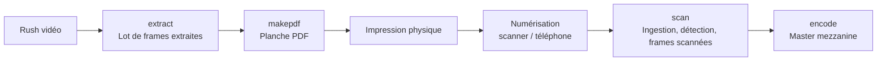

# Concepts de base

Ce document **enseigne le vocabulaire**. C'est le seul du dépôt qui définisse
ces mots pour un lecteur humain : tout le reste (la CLI, la TUI, les messages)
les *emploie*. Un mot, un objet.

---

## Vocabulaire

### Les huit objets

Ce sont les huit natures que l'outil publie et affiche.

**Cinq d'entre elles portent un rang de version** (`_v2`, `_v3`…) au lieu d'être
écrasées : le **lot**, la **planche**, le **scan**, le **lot scanné** et le
**master**. Les trois autres n'en portent pas, et l'outil le dit plutôt que de
le taire — un **rush** n'a pas de rang, et un jeu de **frames extraites** ou
**scannées** prend celui du contenant qui le porte :

> `--version` ne s'applique pas a un jeu de frames extraites: il n'a pas de rang
> PROPRE, son rang est celui du lot qui le porte.

| Objet | Définition | Où il vit |
|-------|------------|-----------|
| **Rush** | Le fichier vidéo source. Il reste **hors du projet** : le manifeste en note le chemin, l'outil ne le recopie pas | sur votre disque, où vous l'avez rangé |
| **Lot** | L'ensemble des **frames extraites** d'un rush par `extract`, à une cadence donnée. C'est un **contenant** : il ne pèse rien de lui-même | déclaré au manifeste (`lots[]`) |
| **Frames extraites** | Le **contenu** d'un lot : les TIFF 16 bits sortis du rush | `extract-frames/<rush>_<cadence>/` |
| **Planche** | Le PDF imprimable d'un lot (frames + QR + ArUco + patchs de calibration). Chaque génération est un **tirage**, numéroté | `planches/` |
| **Scan** | Les pages d'une planche **une fois imprimées et numérisées**, ingérées telles quelles | `scans/<slug>/` |
| **Lot scanné** | Le lot **reproduit à partir d'un scan**. C'est un **contenant**, exactement comme le lot | déclaré au manifeste (`lots[].reconstructions[]`) |
| **Frames scannées** | Le **contenu** d'un lot scanné : les TIFF 16 bits redécoupés depuis les pages scannées | `frames-scannees/<rush>_<cadence>/` |
| **Master** | La vidéo mezzanine reconstruite par `encode` à partir des frames scannées | `outputs/` |

### La distinction qui fait exister ce document

**Le contenant est un *lot scanné*, le contenu est un *jeu de frames
scannées*.** Ce sont deux objets, pas deux façons de dire le même.

* on **supprime un lot scanné** — le contenant, avec son rang de version :
  `project remove --lot <id> --lot-scanne --version <rang>` ;
* on **compte des frames scannées** — le contenu : « 6 frame(s) écrite(s) ».

La symétrie est voulue et elle se lit dans les deux moitiés de la chaîne :

| moitié | contenant | contenu |
|---|---|---|
| avant l'impression | **lot** | **frames extraites** |
| après le scan | **lot scanné** | **frames scannées** |

### Ce que « frame » ne veut plus dire tout seul

Le mot **frame** nu est ambigu et n'est plus employé seul pour désigner un
objet : une frame *extraite* et une frame *scannée* ne sont pas au même endroit
de la chaîne, ne portent pas le même nom de fichier et ne se suppriment pas de
la même façon.

| ce qu'on voit | ce que c'est |
|---|---|
| `rush-001_5_00-00-00-00.tiff` | une **frame extraite** (le rush l'a produite) |
| `scan_rush-001_5_00-00-00-00.tiff` | une **frame scannée** (le préfixe `scan_` la distingue) |

### Les mots qui ne sont pas des objets

| Terme | Définition |
|-------|------------|
| **Projet** | Le dossier racine, avec son manifeste `project.json` |
| **Page** | Une page d'une planche. Détail interne de mise en page : on ne manipule pas une page comme un objet |
| **Payload** | Les données encodées dans le QR d'une page : identité du lot, timecodes, géométrie, calibration |
| **Gabarit** (`template_id`) | Mise en page d'une planche (ex. `tpl-a4-portrait-2f-v2`) |
| **Profil de calibration** | La correction couleur d'une **chaîne de scan** (scanner + pilote + réglages), pas d'un projet |

---

## Filiation : qui pend de quoi

```
rush
├── lot                          (les frames extraites du rush, par `extract`)
│   ├── frames extraites         extract-frames/<rush>_<cadence>/
│   ├── planche                  planches/<projet>_<lot>_<mise-en-page>.pdf
│   └── master                   outputs/<lot>_mmu_<profil>.<conteneur>
└── scan                         scans/<slug>/
    └── lot scanné               (reproduit depuis le scan)
        └── frames scannées      frames-scannees/<rush>_<cadence>/
```

**Le scan est le frère du lot, pas son annexe** ; le lot scanné est l'enfant du
scan. Un scan s'ingère avant même que l'identité du lot soit connue — elle est
portée par le QR imprimé et n'est décodée qu'à l'étape suivante.

Le **master** est rattaché au lot, mais il est reconstruit depuis les **frames
scannées** : c'est le point où les deux moitiés de la chaîne se rejoignent.

---

## Architecture des données

L'arborescence réellement créée dans un projet :

```
projet/
├── extract-frames/            # Frames extraites, un dossier par lot
│   └── <rush>_<cadence>/      #   rush-001_5_00-00-00-00.tiff …
├── scans/                     # Un dossier par scan ingéré
│   └── <slug>/
│       ├── ingest.json        #   Métadonnées d'ingestion (dpi, format, date)
│       ├── detections/        #   Documents de `scan detect` (géométries, payloads)
│       └── <source>.pdf       #   Le document scanné, tel qu'il a été livré
├── frames-scannees/           # Frames scannées, un dossier par lot scanné
│   └── <rush>_<cadence>/      #   scan_rush-001_5_00-00-00-00.tiff …
├── planches/                  # Planches PDF imprimables
├── outputs/                   # Masters encodés
├── versions/                  # Artefacts versionnés du projet
│   └── calibration/           #   Profils de calibration de chaîne
├── logs/                      # Journaux d'exécution
└── project.json               # Le manifeste du projet
```

`scans/`, `planches/`, `logs/` et `versions/` sont créés à l'ouverture du
projet ; `extract-frames/` et `frames-scannees/` apparaissent avec le premier
lot et le premier scan. Le rush source, lui, n'est **pas** copié dans le
projet.

### Un projet créé avant ce vocabulaire continue de marcher

Deux dossiers ont changé de nom :

| ancien nom | nom actuel |
|---|---|
| `frames/` | `extract-frames/` |
| `output-frames/` | `frames-scannees/` |

**Rien à convertir.** Les anciens noms restent **reconnus en lecture,
indéfiniment** : inventaire, scan, encodage et suppression trouvent un projet
qui les porte. Ils ne sont simplement **plus jamais écrits** — un lot neuf
prend le nom neuf, un lot déjà écrit sous l'ancien nom y reste d'un seul
tenant. Il n'existe **ni commande de conversion, ni conversion automatique** :
convertir serait écrire sur vos données sans que vous l'ayez demandé.

Vous verrez donc `frames/` et `output-frames/` sur le disque d'un vieux
projet. C'est normal, et il n'y a rien à faire.

### Le manifeste garde les anciens noms de clés, et c'est assumé

`project.json` continue de nommer ses clés `output_frames_dir` et
`reconstructed_frame_count` là où l'interface dit « frames scannées ». Seules
les **valeurs** suivent le disque :

```json
"frames_dir":        "extract-frames/rush-001_5",
"output_frames_dir": "frames-scannees/rush-001_5"
```

C'est un écart volontaire : renommer une clé change le contrat d'un document
que des projets réels portent déjà. Il est nommé ici plutôt que tu, parce que
c'est un fichier que vous pouvez ouvrir.

---

## Flux de travail typique



La calibration couleur est optionnelle et se prépare à part : une page de
calibration s'imprime, se scanne une fois, et donne un profil réutilisable par
tous les scans de la même chaîne.

---

## Formats supportés

| Type | Formats |
|------|---------|
| Vidéo entrée | tout ce que `ffmpeg` décode (MP4, MOV, MXF…) |
| Entrée de scan | dossier d'images, image unique (PNG/JPEG/TIFF), ou PDF multipage |
| Frames extraites et scannées | TIFF 16 bits |
| Master encodé | `prores_422`, `prores_hq`, `prores_lt`, `dnxhr_hq`, `dnxhr_hqx`, `h264_delivery`, `hevc_delivery` |

---

## Identifiants

- **`project_id`** : slug du projet (ex. `mon_projet`)
- **`rush_id`** : slug du rush (ex. `rush-001`)
- **`lot_id`** : `rush_id` + cadence cible (ex. `rush-001_5`)
- **`template_id`** : gabarit de planche (ex. `tpl-a4-portrait-2f-v2`)
- **rang de version** : suffixe `_v2`, `_v3`… porté par n'importe lequel des
  huit objets. Un rang se **consomme** et ne se rend qu'en queue, sur demande

---

## Le versionnage, et la suppression qui va avec

### Rien n'est écrasé en silence, rien n'est bloqué sèchement

Le scénario qui a fait exister cette règle, et qui se reproduira : vous avez
fait une planche, vous l'avez imprimée, scannée, extraite. Sur une frame, vous
vous dites que vous auriez pu ajouter un point rouge dans un coin. Vous reprenez
la planche imprimée, vous ajoutez le point, vous rescannez le lot.

Le contenu a changé, l'identité non. **Ce n'est ni un doublon ni une erreur,
c'est une version.**

Devant une sortie qui existe déjà, l'outil propose donc toujours **au moins deux
issues**, et jamais un refus sans suite :

* `--nouvelle-version` écrit à côté, sous le rang suivant, sans toucher à
  l'existant ;
* `--overwrite` réécrit en place, sciemment, après avertissement. Une écriture
  destructive **consciente** reste possible : si vous l'avez demandée, il y a
  peut-être une raison.

`makepdf` est le seul à verser le rang de lui-même, sans qu'on demande rien :
une planche n'est jamais qu'un tirage de plus.

### Un rang consommé le reste

Après avoir retiré la planche `_v2`, la suivante sera `_v3` : le rang ne revient
pas tout seul, sans quoi deux sorties différentes porteraient le même numéro.
`--liberer-le-rang` le rend explicitement, et **seulement sur le dernier à
date**.

### Supprimer est la troisième opération

Sans elle, le versionnage ne fait que remplir le disque — une version de lot 4K
à 12 im/s pèse plus de 2 Go. `mmu project remove` retire un élément du manifeste
**et** du disque, en deux temps : sans `--confirmer`, il montre ce qui partirait
et n'écrit rien.

**On désigne un objet par les arguments qui l'ont produit**, plus son rang : un
master par son profil d'encodage, une planche par son lot, jamais par un chemin.

---

## Calibration couleur (aperçu)

1. **Générer** la page de calibration de votre chaîne de scan :
   `mmu makepdf --project <dir> calibration-page --chaine "<libellé>"`
2. **Imprimer**, **scanner**, puis en tirer le profil :
   `mmu scan --project <dir> --scan <page.tiff> --dpi 600 calibrate --nom <nom>`
3. **Appliquer** à un scan : `mmu scan … --profil <fichier>`, ou une fois pour
   toutes : `mmu set-default-profile --project <dir> --profil <fichier>`

Les options de `makepdf` et de `scan` se posent **avant** leur sous-commande :
`--project` appartient à `makepdf`, pas à `calibration-page`.

Sans profil désigné et sans profil par défaut, le lot est livré **brut**, avec
un avertissement : aucun profil n'est choisi à votre place.
